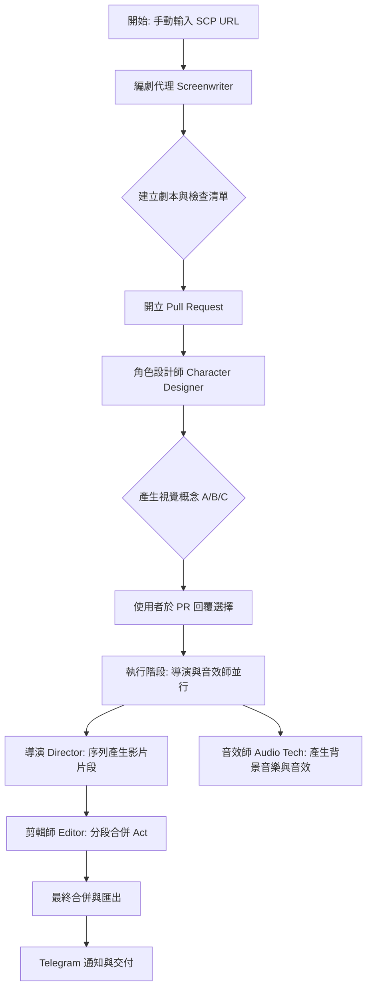

# Omni-Drama-Studio

Omni-Drama-Studio 是一個自動化的 AI 影片製作流水線，利用多智能體（Multi-Agent）工作流，將 SCP 基金會的文章轉換為電影感影片（影片長度可自訂，預設為 5 分鐘）。

## 核心概念

本專案旨在利用最強大的 AI 模型，實現從文字到影像的自動化轉化。透過一系列專門的 AI 代理人，我們能自動完成資料爬取、劇本編寫、角色設計、影片生成、音效配製以及最終剪輯。

## 工作流程

### 階段詳解

1.  **階段 1 (劇本編寫 - Screenwriter)**:
    *   爬取指定的 SCP URL。
    *   將內容結構化為 `script.json`（分為多個 Act，每個片段 4-8 秒）。
    *   建立 `checklist.md` 追蹤進度。
2.  **階段 2 (角色設計 - Character Designer)**:
    *   提供三種視覺概念（A/B/C）供使用者選擇。
    *   提取 5 個核心外觀特徵（Appearance Seeds）以確保視覺一致性。
3.  **階段 3 (生產製作 - Director & Audio Tech)**:
    *   **導演 (Director)**: 使用 Imagen 4.0 (imagen-4.0-generate-001) 先行為每個片段生成首尾關鍵影格，接著使用 Veo 2.0 (veo-2.0-generate-001) 以首尾影格生成影片，確保片段間的完美連續性。
    *   **音效師 (Audio Tech)**: 使用 Lyria 3 產生長篇背景音樂與特定音效。
4.  **階段 4 (交付階段 - Editor)**:
    *   進行分段合併（Sub-Editing）與最終合併（Final-Editing）。
    *   確保 30fps 與精確的時間軸對齊。
    *   完成後透過 Telegram 進行通知。

## 如何開始

1.  前往本儲存庫的 **GitHub Actions** 頁面。
2.  選擇 **Phase 1: Screenwriter** 工作流。
3.  點擊 **Run workflow**：
    *   輸入你想要轉換的 SCP 文章 URL（支援 `http://scp-zh-tr.wikidot.com/`）。
    *   （可選）輸入你期望的影片最大長度（`maximum_video_duration`），單位為分鐘，預設為 5。
4.  等待編劇完成並開立 PR 後，在 PR 留言中回覆選擇的視覺概念（例如：`@bot choose B`）。

## 技術棧

*   **Runtime**: Node.js 22
*   **Orchestration**: GitHub Actions
*   **Cloud Storage**: Cloudflare R2
*   **AI Models**:
    *   **Logic/Script**: Gemini 1.5 Pro
    *   **Image**: Imagen 4.0
    *   **Video**: Veo 2.0
    *   **Audio**: Lyria 3
*   **Crawler**: agent-browser

## 環境變數要求

完成初始化後，請確保在 GitHub Secrets 中配置以下變數：
*   `GEMINI_API_KEY`: Google Gemini API 金鑰。
*   `R2_ACCESS_KEY_ID`: Cloudflare R2 存取金鑰。
*   `R2_SECRET_ACCESS_KEY`: Cloudflare R2 秘密金鑰。
*   `R2_BUCKET_NAME`: R2 儲存桶名稱。
*   `R2_ENDPOINT`: R2 端點 URL。
*   `GITHUB_TOKEN`: 用於觸發工作流與管理 PR。
*   `TELEGRAM_BOT_TOKEN`: 用於通知。
*   `TELEGRAM_CHAT_ID`: 通知對象 ID。
